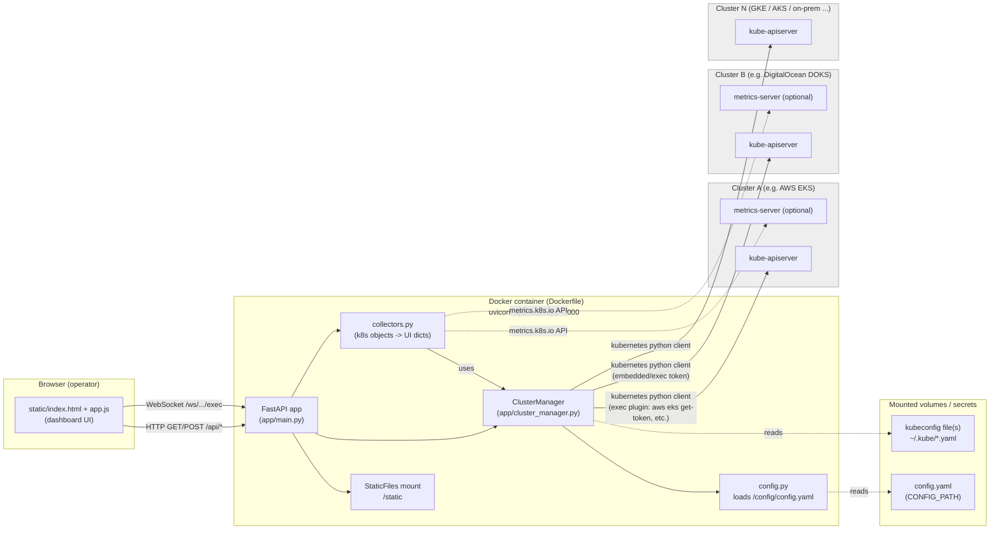
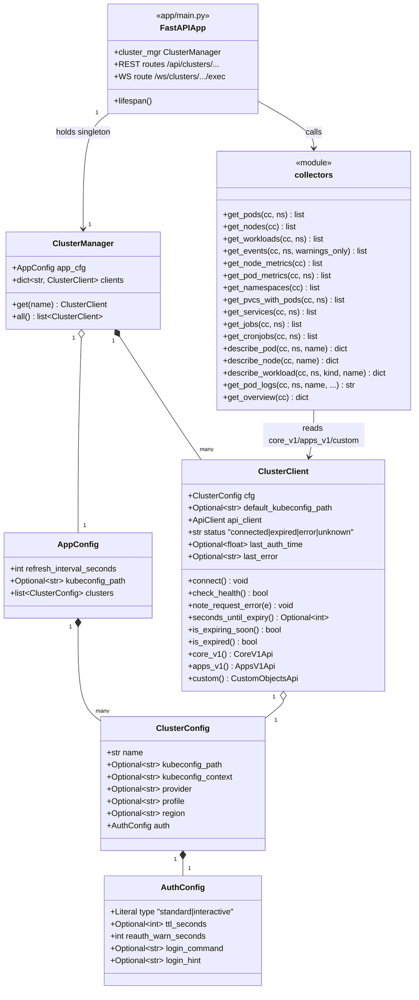
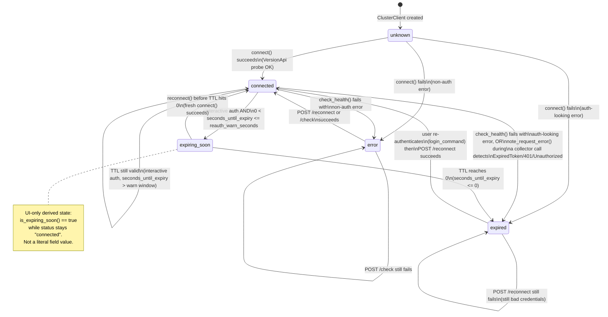
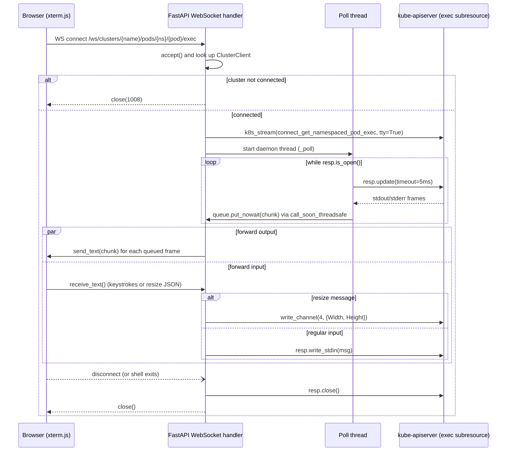

# Architecture Diagrams

Diagrams are [Mermaid](https://mermaid.js.org/) — they render natively on GitHub, GitLab,
and in VS Code with the "Markdown Preview Mermaid Support" extension.

## 1. Infrastructure / deployment diagram

Shows how the app is deployed (single container, no database) and how it reaches
multiple Kubernetes clusters purely through kubeconfig files — it never talks to a
cloud provider API directly.

Key points reflected in the diagram:

- **Single stateless container** — no database; all state (`cluster_mgr`, per-cluster
  connection status) lives in process memory, rebuilt from `config.yaml` at startup
  (`app/main.py:36` lifespan hook).
- **Kubeconfig-only auth** — `ClusterManager` never talks to AWS/DO/GCP/Azure APIs
  itself; it hands each `ClusterConfig.kubeconfig_path`/`kubeconfig_context` to the
  `kubernetes` Python client, which drives whatever `exec:` plugin or embedded token
  the kubeconfig specifies.
- **Two live channels from the browser**: regular REST polling (`/api/clusters/...`)
  for dashboard data, and a WebSocket (`/ws/clusters/{name}/pods/{ns}/{pod}/exec`) that
  proxies an interactive shell into a pod via the Kubernetes exec subresource.

## 2. Class diagram

Core domain model: configuration → connection/auth state → collector functions that
turn live cluster objects into UI-ready dicts.

## 3. Cluster connection state diagram

Every `ClusterClient` tracks its own connection/auth lifecycle independently, so one
expired cluster doesn't affect others. This mirrors the `status` field driven by
`connect()`, `check_health()`, and `note_request_error()` in `app/cluster_manager.py`.

## 4. Pod exec WebSocket sequence

Bonus — the one genuinely stateful, bidirectional flow in the app (`app/main.py:230`),
worth capturing since it's easy to misread from the code alone.

